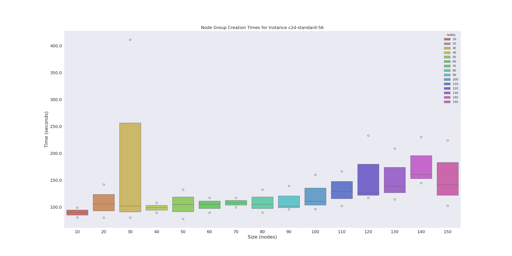
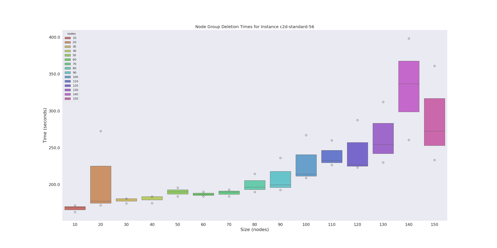
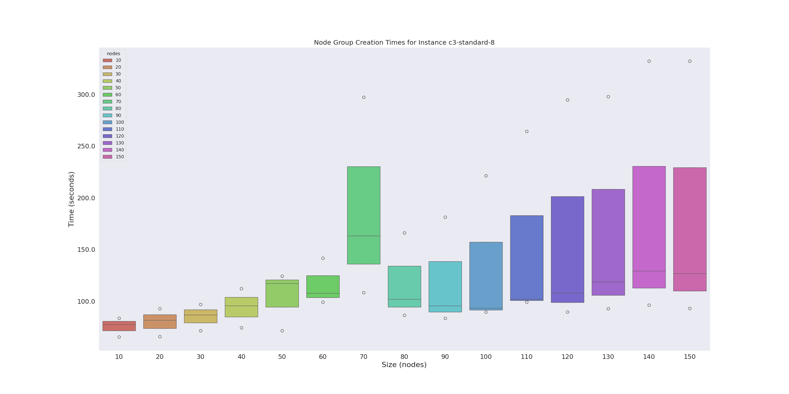
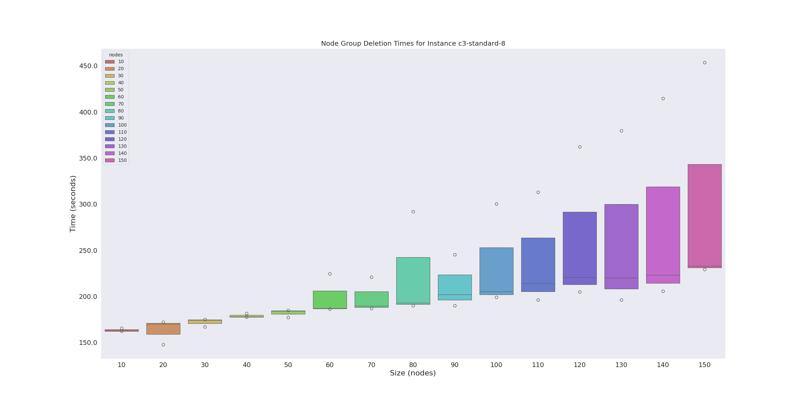

# Infinite Resources

> The cloud has infinite resources.

But does it, really? This (to me) seems like the biggest ingredient in the "missing consumer information to make informed choices" story.  Here is the proposed experiment. We actually need to do this because we cannot do any of our planned experiments if we are unable to get resources.

1. Choose a cloud (e.g., Google)
2. Choose an instance type (e.g., c3-standard-N)
3. Make requests to get a complete allocation from size 1..N. For each size:
4. Time from request to fulfillment
5. How high can we go before we don't get them?
6. Need to set our own limits

I'm assuming in the above (based on not being able to get small numbers, e.g., for c3 instances) that the limit will be small, but we should be weary of costs, etc. We are going to test the context that would be needed for HPC, specifically:

- compute or HPC family instances
- compact mode
- single threaded
- not spot

To put the above in the context we described for our experiments:

What is the limit of a cloud resource (empirically)?

- We want to demonstrate for some scoped resource, possibly at different times) if we can get what we asked for. We want to talk about the tradeoffs between cost and waiting time, because we are paying for the resources while we wait. 

Question / problem: how do we test this when we can't get quota?

## Experiments

I ran these from Tuesday March 26 to Friday March 29th, 3x a day.

```bash
python run-experiment.py --name c3-standard-8 --tag morning
python run-experiment.py --name c2d-standard-56 --tag morning

python run-experiment.py --name c3-standard-8 --tag afternoon
python run-experiment.py --name c2d-standard-56 --tag afternoon

python run-experiment.py --name c3-standard-8 --tag evening
python run-experiment.py --name c2d-standard-56 --tag evening
```

Note that morning is before noon (mountain time), afternoon is noon to 4pm, and evening is 6pm and later.

I was planning on doing 3 runs in a day, but wound up only doing _one_ day because the total costs (just for the instances going up and down) was $500. Sheesh.







